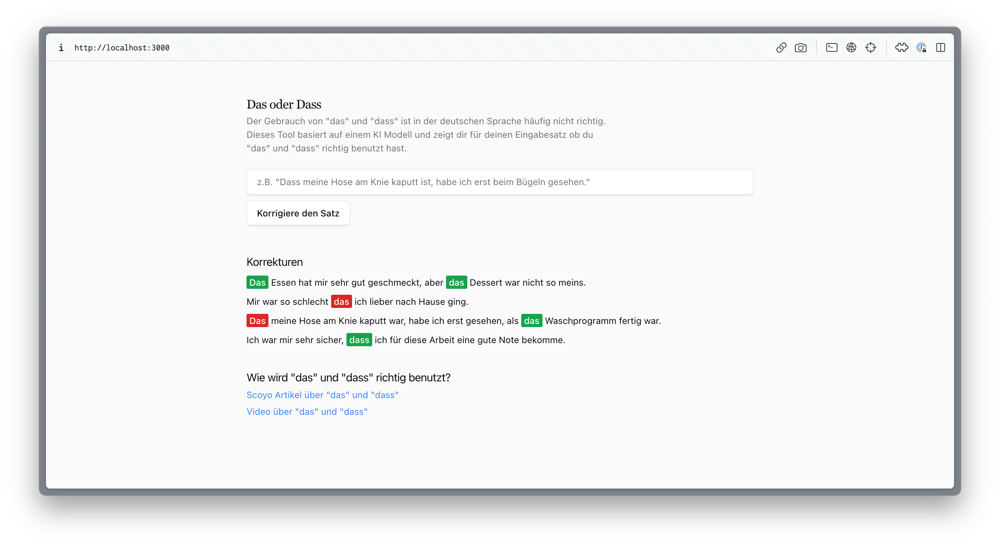

# Das or Dass

This is an AI-powered tool to check german sentences for correct usage of 'das' and 'dass'.
According to multiple resources, this is the most frequent error in the german written language.
The tool uses a custom language model, finetuned using a pre-trained german BERT model.



## Local Development

If you want to use the code for your own project you can clone the repository, install the dependencies and run the development server using:

```bash
npm run dev
# or
yarn dev
# or
pnpm dev
```

Then, open [http://localhost:3000](http://localhost:3000) with your browser to see the result.
